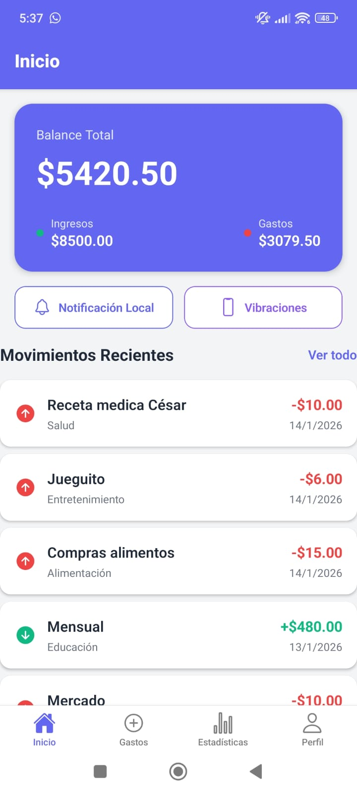
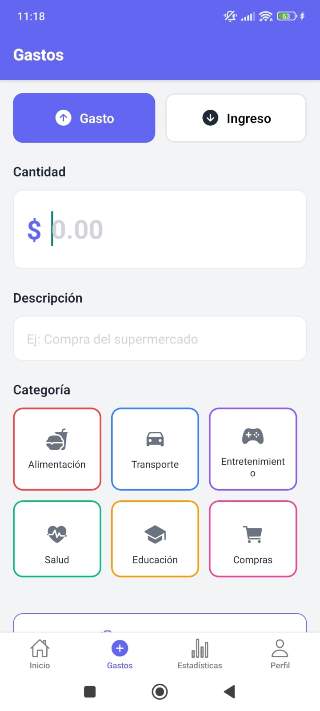
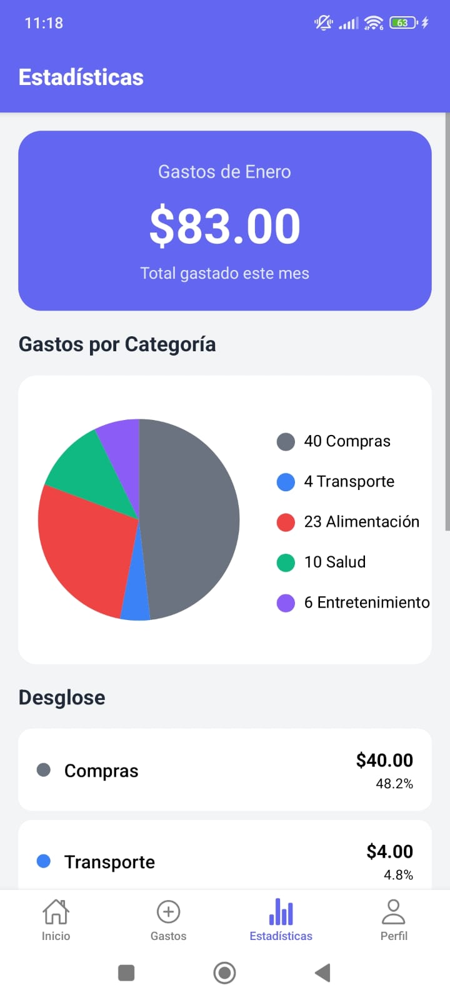
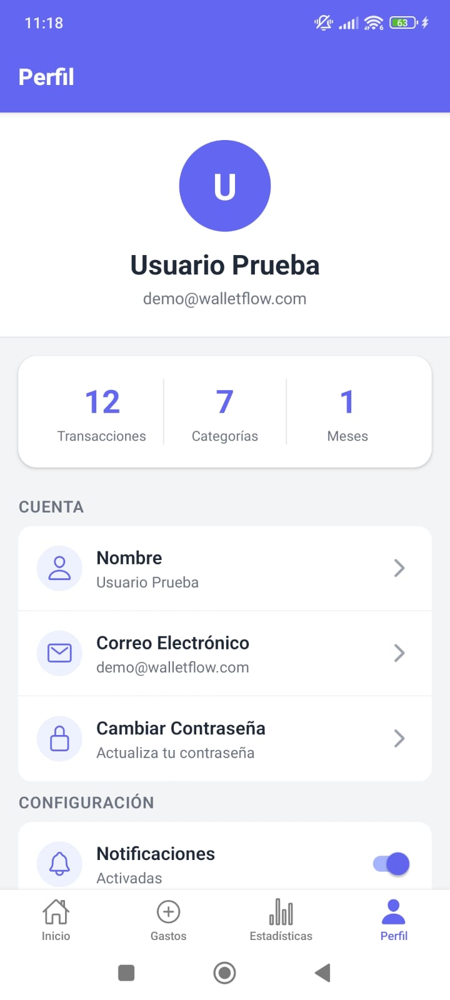

# 🚀 Portafolio – Fabricio Mendoza

Este repositorio centraliza mis proyectos de desarrollo móvil, desarrollo web y automatización de procesos, enfocados en aplicaciones reales con buenas prácticas de arquitectura, UI/UX y consumo de APIs.

---

## 📱 Aplicaciones Móviles

### 🏥 Hospital Security App

Aplicación Android nativa para la gestión de control de acceso y monitoreo de visitantes en entornos hospitalarios, orientada a personal de seguridad.

**Stack:** Kotlin, Jetpack Compose, Material 3, MVVM

**Características clave:**
- Dashboard en tiempo real
- Registro y monitoreo de visitantes
- Alertas visuales y control por plantas
- UI moderna y responsive

🎥 [Demo en video](./assets/App-hospital/App-Hospital.mp4)  
🔗 **Repositorio:** [App-hospital](https://github.com/FabricioMendoza-GT/App-TiendaGaming)

---

### 🎮 Gaming Store – Gameclub

Aplicación Android nativa tipo E-Commerce gaming, con carrito de compras, autenticación y conversión de monedas en tiempo real.

**Stack:** Kotlin, Jetpack Compose, Room, MVVM

**Características clave:**
- Catálogo de productos gaming
- Carrito dinámico y checkout
- Autenticación local
- Conversión de monedas con API externa

🎥 [Demo en video](./assets/App-TiendaGaming/App-TiendaGaming.mp4)  
🔗 **Repositorio:** [App-Tienda](https://github.com/FabricioMendoza-GT/App-TiendaGaming)

---

### 💰 WalletFlow

Aplicación móvil multiplataforma para la gestión de finanzas personales, con backend robusto y enfoque en experiencia de usuario.

**Stack:** Expo (React Native), Laravel, JWT (Sanctum), MySQL/SQLite

**Características clave:**
- Registro de ingresos y gastos
- Estadísticas visuales
- Captura de recibos
- Perfil de usuario y modo oscuro

🖼️ **Capturas de pantalla – WalletFlow**

<table>
  <tr>
    <th>Inicio</th>
    <th>Gastos</th>
    <th>Estadísticas</th>
    <th>Perfil</th>
  </tr>
  <tr>
    <td align="center">
      
    </td>
    <td align="center">
      
    </td>
    <td align="center">
      
    </td>
    <td align="center">
      
    </td>
  </tr>
</table>

🔗 **Repositorio:**  
[App-walletflow](https://github.com/FabricioMendoza-GT/App-walletflow)

---

## 🌐 Aplicaciones Web

### 🧩 CRM Administrativo

Sistema web para la gestión de clientes, roles, objetos y vistas, orientado a flujos comerciales.

**Stack:** React, Node.js, PostgreSQL

**Funcionalidades:**
- Administración de tablas y objetos
- Roles y permisos
- Vistas personalizadas

### 📊 Dashboard Administrativo

Dashboard web para visualización de métricas y control administrativo.

**Stack:** Next.js, Tailwind CSS

**Funcionalidades:**
- Paneles de control
- Vistas administrativas
- Diseño limpio y responsive

## 🔁 Automatización & APIs

### ⚙️ Automatizaciones con n8n

Flujos de automatización para integración entre sistemas mediante APIs y Webhooks.

**Tecnologías:** n8n, REST APIs, JSON

**Casos:**
- Consumo de APIs externas
- Transformación de datos
- Automatización de procesos

### 🔌 API de Extracción de Datos

API REST desarrollada para la extracción y manejo de datos de clientes, aplicando buenas prácticas de limpieza y uso de información.

**Stack:** Node.js, Express

**Funcionalidades:**
- Endpoints REST
- Manejo estructurado de datos
- Uso de Postman para pruebas

## 🧠 Casos de Estudio

Cada proyecto cuenta con documentación donde se explica:

- 📌 El problema a resolver
- 💡 La solución propuesta
- ⚙️ Decisiones técnicas
- 🚧 Retos enfrentados

---

## 📌 Nota

Este portafolio refleja proyectos desarrollados con fines educativos y profesionales, demostrando habilidades en:

✅ Desarrollo móvil nativo y multiplataforma  
✅ Arquitectura limpia y patrones de diseño  
✅ Consumo y creación de APIs  
✅ Automatización de procesos  
✅ Diseño de interfaces modernas

---

## 📬 Contacto

- 📧 Email: *(Studentmendoza3@gmail.com)*
- 🐙 GitHub: *([Perfil](https://github.com/FabricioMendoza-GT))*

---

  <i>Desarrollado con pasión por Fabricio Mendoza</i>

